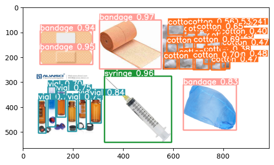

# Medical Instrument Detection with YOLOv5 and Python

  

## 🚀 Project Overview

This project implements a **pretrained YOLOv5 network** in Python to **detect and classify medical instruments**. The goal is to identify multiple objects within a single image accurately, even when classes are imbalanced.  

The dataset used is **Medical Waste Recognition**, containing 2,268 images across 12 categories such as gloves, syringes, bandages, test tubes, and more.  

**Problem addressed:** Object detection and classification in medical environments, which can help automate inventory management, reduce errors, and optimize workflows.

## 🧰 Technologies & Tools

- **Python 3.10+**  
- **YOLOv5 (Ultralytics)**  
- **OpenCV**  
- **PyTorch**  
- **Roboflow Dataset: Medical Waste Recognition**  

## 📊 Results

- Overall **Precision:** 0.766  
- Overall **Recall:** 0.535  

**Top performing classes:**  
- Mask: 0.954  
- Syringe: 0.915  
- Gloves: 0.905  

**Lowest performing classes:**  
- Test tube: 0.000  
- Scissors: 1.000  
- Waste: 0.525  

The model performs well for classes with sufficient data (>600 samples) while underperforming on underrepresented classes. Adding more samples to low-data classes can improve performance.

**📚 References**

YOLOv5 Documentation - Ultralytics

Medical Waste Recognition Dataset - Roboflow

YOLO: You Only Look Once (Redmon et al., 2016)

**✨ Portfolio Summary**

This project highlights my skills in Python programming, deep learning, and computer vision, demonstrating the ability to handle real datasets, train neural networks, and interpret results.
It is a practical example of applying AI to solve real-world medical imaging problems, making it an ideal showcase for a portfolio or résumé.
